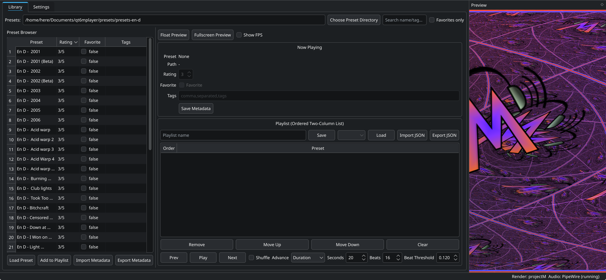

# qt6mplayer

Qt6 desktop shell for [`projectM`](https://github.com/projectM-visualizer/projectm) with PipeWire audio input on Linux.



## For Users

### Download

1. Open the GitHub **Releases** page.
2. Download `qt6mplayer-<version>-<arch>.AppImage`.

### Run

```bash
chmod +x qt6mplayer-*.AppImage
./qt6mplayer-*.AppImage
```

### First-time Setup

1. Open **Settings**.
2. In **Audio Input**, click **Refresh**.
3. Pick one device and keep it.
4. If fullscreen is too heavy, pick an **Upscaler Preset** (Quality/Balanced/Performance), then fine-tune **Render Scale** and **Upscale Sharpness** if needed.
5. Choose **GPU Preference** if you have multiple GPUs (restart required).

The selected input is persisted and reused on next launches.

### Shortcuts

- `F11`: Toggle preview fullscreen.
- `Esc`: Exit fullscreen preview and redock.

### Notes

- If PipeWire is unavailable, app falls back to dummy audio input.
- Provide your own preset folder (for example `~/.projectM/presets`) and select it in the UI.
- GPU preference is applied at startup via PRIME-related env vars (`DRI_PRIME`, and for NVIDIA systems
  `__NV_PRIME_RENDER_OFFLOAD` / `__GLX_VENDOR_LIBRARY_NAME`) when those vars are not already set externally.
- You can override GPU choice per launch with `QT6MPLAYER_GPU=auto|dgpu|igpu`.

### Preset Packs

`qt6mplayer` does not bundle presets. These upstream collections are good starting points:

- [`presets-cream-of-the-crop`](https://github.com/projectM-visualizer/presets-cream-of-the-crop): large curated set (around 10,000 presets) assembled by Jason Fletcher; this is the default preset pack used by projectM.
- [`presets-projectm-classic`](https://github.com/projectM-visualizer/presets-projectm-classic): legacy preset collection from the original MilkDrop/Winamp era, maintained as a separate pack for projectM users.
- [`presets-en-d`](https://github.com/projectM-visualizer/presets-en-d): compact set (about 50 presets) created by En D.

## For Developers

### Build From Source

#### Arch Linux

```bash
sudo pacman -S --needed cmake ninja gcc pkgconf qt6-base projectm libpipewire
cmake -S . -B build -G Ninja
cmake --build build
./build/qt6mplayer
```

For projectM rendering support (required for release AppImages), install:

```bash
sudo pacman -S --needed libprojectm
```

#### Ubuntu/Debian (example)

```bash
sudo apt install cmake ninja-build g++ pkg-config qt6-base-dev libpipewire-0.3-dev
sudo apt install libprojectm-dev   # if available in your distro/repo
cmake -S . -B build -G Ninja
cmake --build build
./build/qt6mplayer
```

### Build AppImage

```bash
./scripts/build-appimage.sh
```

Output:

- `dist/qt6mplayer-<version>-<arch>.AppImage`

The script auto-downloads official `linuxdeploy` and `linuxdeploy-plugin-qt` AppImages into:

- `tools/linuxdeploy/`

if they are not already installed in `PATH`.

It also downloads an AppImage runtime file (`runtime-<arch>`) into the same folder and passes it to linuxdeploy (`LDAI_RUNTIME_FILE`) to avoid runtime download failures inside appimagetool.

By default the script enforces `projectM-4` availability (`REQUIRE_PROJECTM=1`) so release artifacts do not silently fall back to the non-projectM preview path.

Compatibility note:

- The script sets `NO_STRIP=1` by default to avoid linuxdeploy strip failures on RELR-enabled binaries.
- You can override this with `NO_STRIP=0 ./scripts/build-appimage.sh` if you explicitly want stripping.
- The script forces a Qt6 `qmake` (`qmake6`/`qmake-qt6`) to prevent linuxdeploy-plugin-qt from selecting Qt5.
- The script sets a default `LINUXDEPLOY_EXCLUDED_LIBRARIES` list to skip known optional plugin deps that are often missing (`libjxrglue`/`kimg_jxr`).

### Release On GitHub

Manual release flow:

1. Build locally:
   - `VERSION=<semver> ./scripts/build-appimage.sh`
2. Create/push a tag, for example `v0.2.1`.
3. Create or edit the GitHub release for that tag.
4. Upload `dist/qt6mplayer-<version>-<arch>.AppImage` as the release asset.

Optional helper workflow:

- `.github/workflows/release-appimage.yml` can be run manually (`workflow_dispatch`) to build an AppImage artifact in GitHub Actions.

## Data Storage

Under `QStandardPaths::AppDataLocation`:

- `preset-metadata.json`
- `playlists/*.json`
- Qt settings under `projectm`

## Implemented Features

- Preset browser with search/favorites/metadata editing
- Playlist save/load/import/export and playback controls
- projectM OpenGL render path with fallback renderer
- Floatable/fullscreen preview dock and FPS overlay
- Render-scale upscaling path for fullscreen performance tuning
- PipeWire audio input backend with dummy fallback
- Settings-tab audio device picker and debug panel
